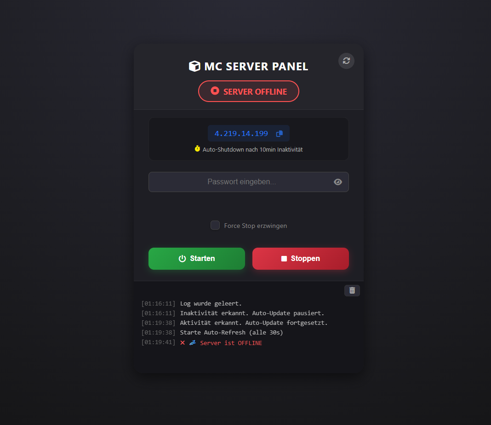

# Azure VM Game Server Manager

Ein kosteneffizientes Fullstack-System zur On-Demand-Steuerung von Azure Virtual Machines. Entwickelt, um Hosting-Kosten für Game-Server (Minecraft) durch intelligente Automatisierung und Serverless-Technologie um bis zu 80% zu senken.


---

## Problem
Cloud-Ressourcen sind teuer. Ein dedizierter Game-Server, der 24/7 läuft, verursacht hohe Kosten, selbst wenn niemand spielt. Das manuelle Starten über das Azure Portal ist für Endanwender (Mitspieler) zu komplex und sicherheitstechnisch bedenklich (RBAC).

## Lösung
Eine **Serverless Middleware** (Azure Functions), die als sicheres Gateway zwischen einem **React Frontend** und der **Azure Management API** fungiert. Kombiniert mit **OS-Level-Skripten** auf der Linux-VM, die Inaktivität erkennen und die Maschine automatisch herunterfahren.

### Key Features

* **Cost Optimization:** Server läuft nur bei Bedarf. Automatische Abschaltung (Deallocation) nach 10 Minuten Inaktivität.
* **Secure Access:** Authentifizierung über Hash-Vergleich in der Azure Function. Kein direkter Zugriff auf Azure Credentials für den Client.
* **Smart Polling:** Das Dashboard fragt den Status intelligent ab (30s Intervalle) und verhindert redundante API-Calls durch Multi-Tab-Synchronisation.
* **Graceful Shutdown & Backup:** Kein "Hard Kill". Der Server speichert den Welt-Status, lädt ein Backup in einen Azure Blob Container und fährt erst dann die VM herunter.

---

## Architektur


### Tech Stack

* **Frontend:** React, Tailwind CSS
* **Backend / Middleware:** Azure Functions (Node.js/Python Trigger)
* **Infrastructure:** Azure VM (Linux Ubuntu), Blob Storage
* **Automation:** Bash, Systemd Services, PowerShell (Az Module)

---

## Deep Dive: Automatisierung

Das Herzstück des Projekts ist nicht nur das Starten, sondern das sichere und automatische Beenden.

### 1. Das Frontend & Gateway
Der User gibt ein Passwort ein. Dieses wird gehasht an die Azure Function gesendet.
* `200 OK`: Hash korrekt -> Befehl an Azure API senden (VM Start/Stop).
* `401 Unauthorized`: Zugriff verweigert.

### 2. OS-Level Scripting (Linux)
Auf der VM laufen mehrere Custom-Services:

* **`mc_start` (CLI Tool):**
  Ein eigens entwickelter Wrapper-Befehl. Startet die VM-Umgebung, mounted notwendige Volumes und führt den Game-Server-Prozess in einer `screen`-Session aus.

* **`autostart.service`:**
  Systemd-Unit, die beim Boot der VM sofort den Game-Server hochfährt. Damit ist der Server "Spielbereit", sobald die VM läuft.

* **`watchdog.sh` (Inaktivitäts-Monitor):**
  Ein Cron-Job/Loop, der alle x Sekunden prüft:
  1. Ist eine aktive TCP-Verbindung auf Port 25565? (Sind Spieler da?)
  2. Wenn nein -> Counter hochzählen.
  3. Wenn Counter > 10 min -> **Trigger Graceful Shutdown**.

### 3. Graceful Shutdown & Backup Strategie
Bevor die VM gestoppt wird, führt das Skript folgende Schritte aus:
1. **Broadcast:** Warnung an eventuell verbliebene Spieler.
2. **Save:** `save-all` Befehl an die Server-Konsole senden.
3. **Backup:** Komprimieren des Welt-Ordners (`tar.gz`).
4. **Upload:** Upload des Backups in Azure Blob Storage (mit Lifecycle Policy, um alte Backups automatisch zu löschen).
5. **Deallocate:** Befehl an Azure CLI, die VM zu deallozieren (Kostenstopp).

---

## Installation & Setup

### Voraussetzungen
* Azure Subscription
* Node.js & npm

### Deployment

1. **Azure Function:**
   ```bash
   cd api
   func azure functionapp publish <APP_NAME>
   ```

2. **Frontend:**
   In `.env` die URL der Azure Function eintragen und builden.
   ```bash
   npm run build
   ```

3. **VM Setup:**
   Kopiere die Skripte aus `/scripts` nach `/usr/local/bin/` auf der VM und aktiviere die systemd services.

---

## Screenshots



---

**Author:** Nikolas  
*Student der Wirtschaftsinformatik @ HKA*
